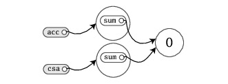
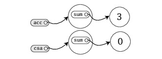

######Function literal / Anonymous function
Scala provides a relatively lightweight syntax for defining anonymous functions. The following expression creates a successor function for integers:
`(x: Int) => x + 1`
######Partially applied function
If a function literal consists of one statement that takes a single argument, you need not explicitly name and specify argument.
`args.foreach(println)`
######Arrays
All arrays in scala are **mutable** although it is impossible to change its sizes.
Arrays are initialized using _factory method_ **apply** which returns mutable sequence of objects which share the same type.
```
val array = Array(1,2,3) <==> val array = Array.apply(1,2,3)
array(1) = 90 //can be modified
val arrayLongerInitialization = new Array[Int](3)
```
######Lists
Scala lists are always **immutable**. They are designed to enable a functional style of programming. Lists are initialized via _factory method_ similary to Arrays.
`:::` method - concatenates two lists and returns new one.
`::`  method called **cons** - prepends a new element to the beginning of an existing list and returns resulting list. Takes constant time!
Methods which ends with colon `:` above are invoked on **right** operand!
`:+` method - appends element to list. **Should not be used** because time to append element grows linearly with list size. Instead `ListBuffer` class should be used when applying such operation. When this is done `toList` can be used to obtain list. Other option is prepending(`::`) element to `List` & call `reverse` method. Each list ends with `Nil`.
`val oneTwoThree = 1 :: 2 :: 3 :: Nil`
######Tuples
Tuples are immutable like scala lists but can contain different types of elements. Indexed from `1` tradition inherited from other languages like Haskell and ML.
```
val tuple = (1,"tuple element", 1.2222)
val tupleWithExplicitType = Tuple2[Int,String](1,"tuple element")
val tupleWithExplicitTypeAndNew = new Tuple2[Int, String](1,"second tuple element")
```
`tuple(1) - will fail` as **apply** method always return the same type
Scala library conceptually allows to defined up to 22 elements in tuple `Tuple22`
######Sets & Maps
Collections libraries differentiate between mutable and immutable i.e. `scala.collection.immutable` & `scala.collection.mutable`. By default scala imports immutable type:
```
val immutableSet = Set(1,2,3)
val mutableSet = mutable.Set(1,2,3)

val immutableMap = Map(3->"element with key 3", 4 -> "element with key 4") //compiler will infer key, value types
val mutableMap = mutable.Map(3->"element with key 3", 4 -> "element with key 4")
```
######Balanced attitude
Prefer `val`s, immutable objects, methods without side effects. Reach for them first. Use `var`s, mutable objects and methods with side effects when you have a specific need and justification for them.
######Objects and classes
Default access modifier is **public**
```
class ChecksumAccumulator {
var sum = 0
}
val acc = new ChecksumAccumulator
val csa = new ChecksumAccumulator
```

```
acc.sum = 3
```


Method parameters in Scala are always **`val` not `var`**! Thank's to it developer does not need to look further to determine if parameter passed was reassigned.
Methods with result type `Unit` are executed for their side effects (mutating state somewhere external to the method or I/O action). If method is executed only for it's side effects it is called **_procedure_**
######Singleton objects
Scala classes cannot have static members. 
Defined by keyword **`object`**. When singleton object shares the same name with a class it's called **_companion object_**. Both **_companion class_** and **_comapnion object_** must be deinfed in the same source file. Companion objects and companion classes can access each other private members.
Class vs. Object: object does not take input parameters (as connot be instantiated), object is implemented as an instance of a _synthetic class_ (same as Java) i.e. `ChecksumAccumulator$`. A singleton object which does not share the same name with a companion class is called **_standalone object_**.